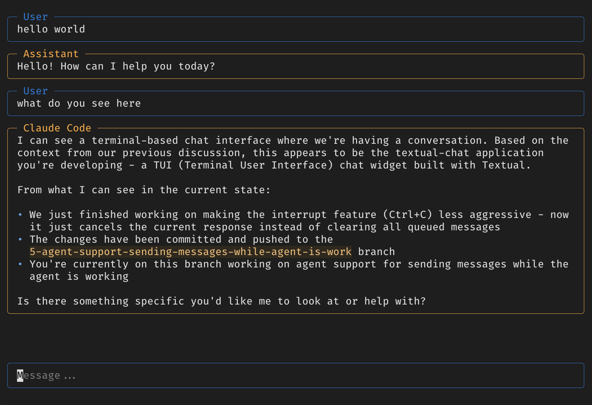

# textual-chat

**LLM chat for humans.** Add AI to your terminal app in a few lines of code.

```python
from textual.app import App, ComposeResult
from textual_chat import Chat

class MyApp(App):
    def compose(self) -> ComposeResult:
        yield Chat()

MyApp().run()
```

That's it. No configuration, no boilerplate.

## Features

- **Zero-config** - Auto-detects your LLM setup and just works
- **ACP agents** - Works with Claude Code, OpenCode, and custom agents
- **Function calling** - Decorate Python functions as tools
- **Fully customizable** - It's a Textual widget, style it however you want

## Install

```bash
uv add textual-chat
```

Or with pip: `pip install textual-chat`

For ACP agent support: `uv add textual-chat[acp]`

## Quick Start

Set an API key:

```bash
export ANTHROPIC_API_KEY=sk-ant-...  # or OPENAI_API_KEY
```

Then run:

```python
from textual.app import App, ComposeResult
from textual_chat import Chat

class MyApp(App):
    def compose(self) -> ComposeResult:
        yield Chat(
            model="claude-sonnet-4-20250514",  # Optional
            system="You are a helpful assistant.",  # Optional
        )

MyApp().run()
```

## Tools

Pass any [FastMCP](https://gofastmcp.com) tool directly:

```python
from fastmcp import FastMCP

mcp = FastMCP("My Tools")

@mcp.tool
def get_weather(city: str) -> str:
    """Get the weather for a city."""
    return f"72°F and sunny in {city}"

chat = Chat(tools=mcp.tools)
```

Or use the `@chat.tool` decorator for quick one-offs:

```python
chat = Chat()

@chat.tool
def search(query: str) -> str:
    """Search the web."""
    return results
```

## Examples

See the `examples/` folder for complete examples:

| Example | Description |
|---------|-------------|
| `basic.py` | Minimal chat app |
| `with_tools.py` | Function calling |
| `with_thinking.py` | Extended thinking (Claude) |
| `with_mcp.py` | MCP server tools |
| `custom_model.py` | Custom model and system prompt |
| `in_larger_app.py` | Sidebar integration with tools |
| `chatbot_modal.py` | Modal dialog pattern |
| `chatbot_sidebar.py` | Toggleable sidebar |
| `with_tabs.py` | Tabbed interface |
| `acp_chat.py` | ACP agent integration |

Run any example:

```bash
uv run examples/basic.py
uv run examples/acp_chat.py examples/echo_agent.py
```

## Configuration

```python
Chat(
    model="claude-sonnet-4-20250514",  # Model ID or agent command
    adapter="litellm",                  # "litellm" or "acp"
    system="You are a pirate.",         # System prompt
    temperature=0.9,                    # Response randomness
    thinking=True,                      # Extended thinking (Claude)
    tools=[fn1, fn2],                   # Tool functions
    cwd="/path/to/project",             # Working directory
    show_token_usage=True,              # Show token counts
    show_model_selector=True,           # Allow /model switching
)
```

## License

MIT

---

Built with [Textual](https://textual.textualize.io/) and [LiteLLM](https://litellm.ai/)
